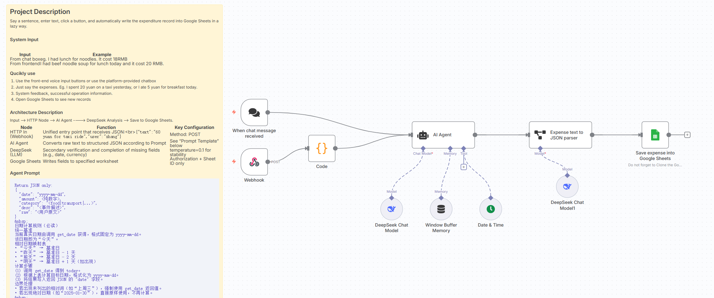
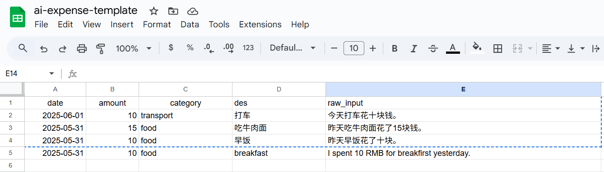

# voice-ledger
built on n8n. voice-ledger is an AI agent that lets you quickly record payment details via voice.

## Simple architecture

## Google Sheet

## Directory structure description
- doc: key documents, such as competitive product analysis, textual materials related to the project.
- pic: Screenshots related to the storage system.
- system: contains the front and back-end code of the project.